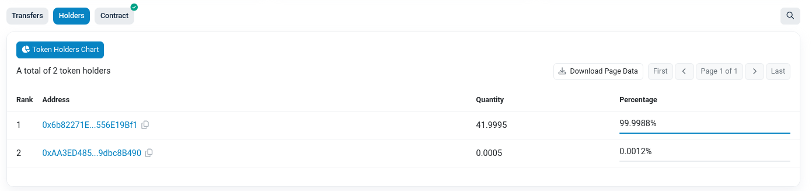

# Only42 Token - Public Blockchain Deployment

## 🚀 Deploy to Real Blockchain

### Phase 1: BSC Testnet Deployment

#### Prerequisites
1. **MetaMask installed** and configured
2. **BSC Testnet network** added to MetaMask
3. **Testnet BNB** from faucet (free)

#### Step 1: Configure MetaMask for BSC Testnet
Official network configurations can be found at [ChainList](https://chainlist.org/):

**BSC Testnet (Chain ID: 97)**: https://chainlist.org/chain/97
```
Network Name: BSC Testnet
RPC URL: https://data-seed-prebsc-1-s1.binance.org:8545/
Chain ID: 97
Currency Symbol: tBNB
Block Explorer: https://testnet.bscscan.com
```

**BSC Mainnet (Chain ID: 56)**: https://chainlist.org/chain/56
```
Network Name: BSC Mainnet
RPC URL: https://bsc-dataseed.binance.org/
Chain ID: 56
Currency Symbol: BNB
Block Explorer: https://bscscan.com
```

#### Step 2: Get Testnet BNB

⚠️ **Note**: The official BSC faucet often has issues. Here are working alternatives:

**Method: BSC Discord (Recommended - Working)**
1. Join BSC Discord: https://discord.gg/bnbchain
2. Go to #testnet-faucet channel
3. Type: `/faucet YOUR_WALLET_ADDRESS`
4. Complete the captcha
5. Wait for confirmation (~30 seconds)

#### Step 3: Deploy on Remix
1. Open Remix IDE
2. Load your `Only42.sol` contract (flattened version)
3. Compile with Solidity 0.8.30
4. **Deploy & Run Transactions** tab
5. Environment: **"Injected Provider - MetaMask"**
6. Select BSC Testnet in MetaMask
7. Deploy with the following parameters:
   - `_initialOwner`: Your wallet address
   - `_multisigOwners`: Array of multisig owner addresses (at least one required)
   - `_requiredApprovals`: Number of approvals needed (must be > 0 and <= number of multisig owners)
8. **Save the contract address!**

#### Step 4: Verify Deployment
- Copy contract address from Remix
- Visit: https://testnet.bscscan.com/address/YOUR_CONTRACT_ADDRESS
- Verify contract shows up
- Check your token balance (Must be 0 at start)
- Check if you can mine

### Phase 2: Contract Verification on BSCScan

#### Why Verify?
- Makes contract source code public
- Users can read the code directly
- Enables direct interaction on BSCScan
- Increases trust and transparency

#### Verification Process
1. Go to https://testnet.bscscan.com/verifyContract
2. Enter your contract address
3. Fill verification form:
   ```
   Compiler Type: Solidity (Single File)
   Compiler Version: v0.8.30+commit.d5f2f7d0
   License Type: MIT License (MIT)
   ```
4. **Contract Source Code**: 
   - Paste your complete contract code
   - Include all imports (flattened)
5. **Constructor Arguments**: 
   - `_initialOwner`: Your wallet address
   - `_multisigOwners`: Array of multisig owner addresses (at least one required)
   - `_requiredApprovals`: Number of approvals needed (must be > 0 and <= number of multisig owners)

   Example encoding:
   ```
   Function: constructor(address _initialOwner, address[] memory _multisigOwners, uint256 _requiredApprovals)
   Parameters: 
   - _initialOwner: YOUR_WALLET_ADDRESS
   - _multisigOwners: [MULTISIG_OWNER_ADDRESS_1, MULTISIG_OWNER_ADDRESS_2, ...]
   - _requiredApprovals: NUMBER_OF_REQUIRED_APPROVALS
   ```
6. Submit and wait for verification

### Phase 3: Publish Token Information

#### On BSCScan
Once verified, your token will appear with:
- ✅ Contract source code visible
- ✅ Read/Write functions accessible
- ✅ Transaction history
- ✅ Token holders list

#### Token Page
Your token will have a dedicated page:
`https://testnet.bscscan.com/token/YOUR_CONTRACT_ADDRESS`

### Phase 4: Test transactions

#### On Metamask
Create a new account based on ETH. Import the BNB network.
And then import the Token via the contract Token adress.
Make a transaction and well done !


*Screenshot showing successful deployment transaction on BSC Testnet*

## 🔗 Useful Links

### BSC Testnet
- **Faucet**: https://docs.bnbchain.org/bnb-smart-chain/developers/faucet/
- **Explorer**: https://testnet.bscscan.com
- **Contract Verification**: https://testnet.bscscan.com/verifyContract

### Tools
- **Remix IDE**: https://remix.ethereum.org/
- **ABI Encoder**: https://abi.hashex.org/
- **Gas Tracker**: https://bscscan.com/gastracker

## ✅ Deployment Checklist

### Pre-Deployment
- [ ] Contract tested thoroughly on Remix VM
- [ ] MetaMask configured for BSC Testnet
- [ ] Testnet BNB acquired
- [ ] Deployment address confirmed

### Deployment
- [ ] Contract deployed successfully
- [ ] Contract address recorded
- [ ] Initial token balance verified
- [ ] Transaction hash saved

### Post-Deployment
- [ ] Contract verified on BSCScan
- [ ] Token page accessible
- [ ] Documentation updated
- [ ] Repository updated with addresses

### Final Steps
- [ ] Test all contract functions on BSCScan
- [ ] Share contract address with community
- [ ] Monitor initial transactions

---

**Remember**: Always test thoroughly on testnet before considering mainnet deployment!
